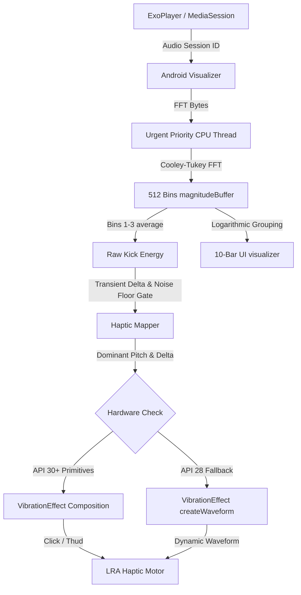

# Haptiq 🎛️

Haptiq is a premium, high-fidelity Android audio player that translates real-time sound frequencies into localized haptic waveforms. Designed for modern LRA (Linear Resonant Actuator) motors, Haptiq uses advanced digital signal processing (DSP) to create a tactile listening experience—letting you physically feel the punch of a kick drum and the deep rumble of sub-bass.

Since v1.12 it also *looks ahead*: a beat grid and motor-calibrated scheduler pre-fire the motor so every kick lands exactly on the beat, and a visual kick-map editor lets you teach any song your motor can't read automatically.

---

## 🚀 Key Features

*   **Real-Time 10-Band Logarithmic Spectrum Analyzer:** Decoupled visualizer that bands 512 FFT bins into 10 logarithmic groups (`Sub` to `Air`) for a fluid UI display.
*   **Dual-Engine Haptic Pipeline:**
    *   *Engine 1 (Kick Punch):* Uses hardware-accelerated `PRIMITIVE_CLICK` (API 30+) for zero-latency, overvolted transient snap.
    *   *Engine 2 (Sub-Bass Drone):* Uses dragging `PRIMITIVE_THUD` vibrations combined with exponential decay curves to simulate low-end weight.
*   **Haptic Sidechaining:** Kick transients instantly override and cancel currently playing sub-bass drones to prevent motor saturation and maintain separation.
*   **AOT Kick Lookahead:** An ahead-of-time scheduler pre-fires the motor by your motor's *measured* dispatch→onset latency (p50 from gyro-confirmed onsets, clamped 20–120 ms), so the vibration peaks exactly when the audio hits. A kick-onset overlay on the seek-preview scrubber shows precisely where kicks will pre-fire, and a per-song "map ready" state tracks beat-grid coverage.
*   **Kick-Character Hit Axis:** Every kick renders as a *decaying* strike-train shaped by its character — **SNAP → PUNCH → THUMP → HEAVY** (35/80/140/240 ms). Longer characters keep the motor moving through surface damping, so a HEAVY kick actually transfers energy through a table or mattress. Presets (THUMP, PUNCH, HEAVY, SNAP) set character + intensity together.
*   **Visual Kick-Map Editor:** See the song's bass waveform with every detected transient, the beat grid, and a live playhead. Tap peaks to pin kicks (snapped to the exact real transient — no human-latency guessing), pinch-zoom to 6×, drag the playhead to audition a section by feel, or hit **At playhead** to set a kick exactly where the seeker is. Saved per song, it overrides auto-detection and survives re-analysis.
*   **Shareable Kick Maps:** Export a taught map to a JSON file (song title/artist/duration + kick times) and import it onto any song on any device — the same kicks, exactly placed.
*   **Self-Calibrating Beat Grid:** Refined tempo detection (parabolic interpolation on the autocorrelation peak + harmonic disambiguation) walks the grid onset-by-onset, snapping each expected beat to the nearest real transient. It hugs the music instead of drifting off a rigid 40 ms quantization — the fix for tracks that auto-detection used to score "4 of 14" on.
*   **Adaptive Haptics with Surface Feedback:** Two-time-constant tracking (fast kick peak for gating + slow loudness floor for the noise baseline) keeps kick detection alive in loud sections. An optional gyro-measured surface feedback loop steps the kick character up automatically on damping surfaces (off by default until tuned on-device).
*   **Motor Latency Instrumentation:** A debug-only tracker measures dispatch→vibrate onset with gyro confirmation (`logcat -s KickLatency`), turning tuning knobs into measured quantities.
*   **YouTube-Music-Style Now Playing:** A persistent overlay sheet that morphs between a docked mini-player and full screen — tap, drag, or fling it open; flick horizontally to skip tracks; drag past the docked floor to dismiss playback.
*   **Stem-Style Tuning Dashboard:** Expandable Compose control deck lets you toggle engines, slide the detection bin range, and adjust thresholds on the fly without recompiling.
*   **Media3 Background Playback Service:** Fully integrated background audio service running a `MediaSession` connected to ExoPlayer, providing system lock-screen and Bluetooth media notifications.
*   **Responsive & Accessibility-Compliant UI:** Fluid design that scales seamlessly from Android 9 (API 28, e.g., Sony Xperia XZ1) up to Android 14+ (API 34), complete with TalkBack semantic descriptions, touch-target sizing, and `prefers-reduced-motion` support that gates every infinite animation.

---

## 🛠️ Haptiq DSP Architecture



### How a kick becomes a feel (v1.13+)

1. **Detect** — the track analyzer finds transients and builds a beat grid (refined period, onset-anchored walk).
2. **Look ahead** — the AOT scheduler pre-fires the motor `lead` ms before each kick, where `lead` is your motor's measured dispatch→onset latency, not a guess.
3. **Shape** — the kick renders as a decaying strike-train driven by the chosen character (SNAP → HEAVY), so even a slow ERM stays moving through surface damping.
4. **Teach** — when auto-detection can't read a song (off-tempo, unusual percussion), the visual editor pins kicks to real transients, saved per song and shareable as a file.

---

## 🆕 Recent Milestones

*   **v1.15 (`cbed1a9`):** Fixed the kick-map editor's frozen waveform (a `ScrollState` clamp bug froze pan/zoom/overview-jump at position 0) — the editor now scrolls, zooms, and jumps; added the **At playhead** button with haptic feedback on every pin placement; mini player now **tap-to-opens** (previously only drags worked — the tap branch lived in a code path that never fired).
*   **v1.14 (`ed94d42`):** Beat-grid drift fix, motor-calibrated AOT lead, and **Teach kicks**.
*   **v1.13 (`82ad13c`):** Kick-character axis (SNAP → HEAVY), presets renamed to characters, two-time-constant adaptive tracking + surface feedback loop.
*   **v1.12 (`1f0b47d`):** Haptic latency fixes, **AOT kick lookahead** with beat grid, kick-onset seek-bar overlay, UI motion + contrast audit.

---

## 🤖 Model Collaboration Biography

Haptiq was happily co-created and coded by a team of advanced AI models working in harmony:

1.  **Gemini Pro Extended (Web):** Formulated the core DSP concepts, logarithmic mapping algorithms, and the dual-engine physics pipeline.
2.  **Antigravity (Gemini 3.5 Flash [High] & Claude Sonnet 4.6 [Thinking]):** Designed and implemented the Jetpack Compose user interfaces, the live-tuning dashboard, state flows, and the real-time parameter binding layer.
3.  **Claude Code [Mimo V2.5 Pro] -> Custom API:** Polished the architecture, hardened the transition-only sidechain logic, resolved hardware fallback edge cases, and implemented the Media3 background notification service.

---

## ⚙️ Running Locally

### Prerequisites
*   **Android Studio Jellyfish / Koala / Ladybug**
*   **Android SDK 28+**
*   **A physical Android device** (highly recommended for haptic feedback testing; LRAs do not vibrate in emulator environments).

### Setup Instructions
1.  Clone this repository to your local machine:
    ```bash
    git clone https://github.com/Shema-glitch/Haptiq.git
    ```
2.  Open Android Studio, select **Open**, and pick the `Haptiq` directory.
3.  Allow Gradle Sync to finish.
4.  Run the debug build on your physical device:
    ```bash
    ./gradlew installDebug
    ```
5.  Enjoy high-fidelity haptics! Ensure **Do Not Disturb (DND) is off**, as Android automatically suppresses motor vibrations when active.
