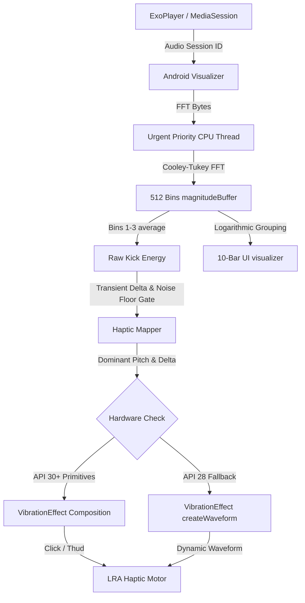

# Haptiq 🎛️

Haptiq is a premium, high-fidelity Android audio player that translates real-time sound frequencies into localized haptic waveforms. Designed for modern LRA (Linear Resonant Actuator) motors, Haptiq uses advanced digital signal processing (DSP) to create a tactile listening experience—letting you physically feel the punch of a kick drum and the deep rumble of sub-bass.

---

## 🚀 Key Features

*   **Real-Time 10-Band Logarithmic Spectrum Analyzer:** Decoupled visualizer that bands 512 FFT bins into 10 logarithmic groups (`Sub` to `Air`) for a fluid UI display.
*   **Dual-Engine Haptic Pipeline:**
    *   *Engine 1 (Kick Punch):* Uses hardware-accelerated `PRIMITIVE_CLICK` (API 30+) for zero-latency, overvolted transient snap.
    *   *Engine 2 (Sub-Bass Drone):* Uses dragging `PRIMITIVE_THUD` vibrations combined with exponential decay curves to simulate low-end weight.
*   **Haptic Sidechaining:** Kick transients instantly override and cancel currently playing sub-bass drones to prevent motor saturation and maintain separation.
*   **Stem-Style Tuning Dashboard:** Expandable Compose control deck lets you toggle engines, slide the detection bin range, and adjust thresholds on the fly without recompiling.
*   **Media3 Background Playback Service:** Fully integrated background audio service running a `MediaSession` connected to ExoPlayer, providing system lock-screen and Bluetooth media notifications.
*   **Responsive & Accessibility-Compliant UI:** Fluid design that scales seamlessly from Android 9 (API 28, e.g., Sony Xperia XZ1) up to Android 14+ (API 34), complete with TalkBack semantic descriptions and touch-target sizing.

---

## 🛠️ Haptiq DSP Architecture



---

## 🤖 Model Collaboration Biography

Haptiq was happily co-created and coded by a team of advanced AI models working in harmony:

1.  **Gemini Pro Extended (Web):** Formulated the core DSP concepts, logarithmic mapping algorithms, and the dual-engine physics pipeline.
2.  **Antigravity (Gemini 3.5 Flash [High] & Claude Sonnet 4.6 [Thinking]):** Designed and implemented the Jetpack Compose user interfaces, the live-tuning dashboard, state flows, and the real-time parameter binding layer.
3.  **Claude Code [Mimo V2.5 Pro] -> Custom API:** Polished the architecture, hardened the transition-only sidechain logic, resolved hardware fallback edge cases, and implemented the Media3 background notification service.

---

## ⚙️ Running Locally

### Prerequisites
*   **Android Studio Jellyfish / Koala / Ladybug**
*   **Android SDK 28+**
*   **A physical Android device** (highly recommended for haptic feedback testing; LRAs do not vibrate in emulator environments).

### Setup Instructions
1.  Clone this repository to your local machine:
    ```bash
    git clone https://github.com/Shema-glitch/Haptiq.git
    ```
2.  Open Android Studio, select **Open**, and pick the `Haptiq` directory.
3.  Allow Gradle Sync to finish.
4.  Run the debug build on your physical device:
    ```bash
    ./gradlew installDebug
    ```
5.  Enjoy high-fidelity haptics! Ensure **Do Not Disturb (DND) is off**, as Android automatically suppresses motor vibrations when active.
